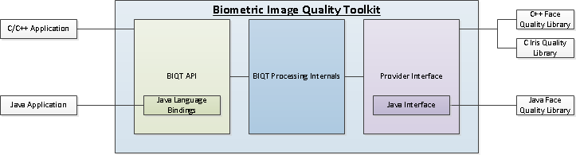

> NOTICE
> 
> This software (or technical data) was produced for the U. S. Government under contract, and is subject to the Rights in Data-General Clause 52.227-14, Alt. IV (DEC 2007)
> 
> (C) 2019 The MITRE Corporation. All Rights Reserved.
> Approved for Public Release; Distribution Unlimited. Public Release Case Number 18-0812.

### Overview

The Biometric Image Quality Toolkit (BIQT) is an extensible framework for 
evaluating the quality of biometric images. It exposes a vendor-agnostic 
interface through which new modalities and algorithms can be integrated into the 
framework, and it also exposes a high-level Quality API which can be used to 
integrate the framework into larger systems.



### Quick Start

Use the [`mitre/biqt`](https://hub.docker.com/r/mitre/biqt) image hosted on Docker Hub to access a preconfigured CentOS 7 environment with the BIQT
command-line interface. This image includes the BIQTIris and BIQTFace providers.

The following Linux-based example shows how to start a `mitre/biqt` container capable of accessing and using the 
biometric images stored in the directory `/path/to/biometric/images` on the host filesystem.

```bash
user@localhost:~/$ docker run --rm -v /path/to/images:/data -it mitre/biqt
[root@66d3679381d0 /]# biqt -m iris iris-image-001.png 
```

### Installation

The framework targets Windows 10 and CentOS Linux 7.4.

Build and install instructions for Docker, CentOS Linux 7.4, and Windows 10 can be found in [INSTALL.md](INSTALL.md).

### Integrating Providers

The BIQT Framework can easily be extended to integrate additional quality libraries. In general, providers
must conform to the following requirements:
  * Providers must include a `descriptor.json` file so that metadata about the provider can be communicated to users.
  * Providers must be installed to `$BIQT_HOME/providers` (Linux) or `%BIQT_HOME%/providers` (Windows).
  * The name of the provider directory, the provider library name, and the name given in a the provider's descriptor must match.

### Setting Up a New Provider

The `setup_provider.py` python script generates a directory structure with template files which
serve as the basis for a new provider. The following example demonstrates how to generate a
new provider named `MyNewProvider`.

**CentOS Linux 7.4**
```
python $BIQT_HOME/scripts/setup_provider.py MyNewProvider
```

**Windows 10**
```
python %BIQT_HOME%/scripts/setup_provider.py MyNewProvider
```

In the above example, the script creates a directory named `MyNewProvider` in the current directory and populates it with a 
minimal descriptor, header file, code file, and CMakeLists.txt. TODO elements in each of these files indicate areas 
which must be addressed.

Once implemented, providers can be built and installed into the framework using the following commands. Note that the BIQT
framework must already be installed and the BIQT_HOME environment variable must be set.


**CentOS Linux 7.4**

```bash
cd ~/MyProvider
mkdir build
cd build
cmake3 -DCMAKE_BUILD_TYPE=Release ..
make
make install
```

**Windows 10**

```
cd C:\Users\user\MyProvider
mkdir build
cd build
cmake -G "NMake Makefiles" -DCMAKE_BUILD_TYPE=Release ..
nmake
nmake install
```

### Related Resources

Reference image quality libraries for face and iris images are available on GitHub.
  * [BIQTFace](https://github.com/mitre/biqt-face)
  * [BIQTIris](https://github.com/mitre/biqt-iris)
  * [BIQTContactDetector](https://github.com/mitre/biqt-contact-detector)
