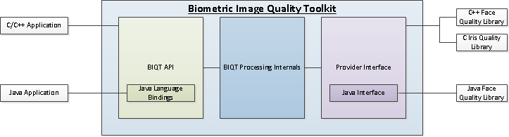

> NOTICE
> 
> This software (or technical data) was produced for the U. S. Government under contract, and is subject to the Rights in Data-General Clause 52.227-14, Alt. IV (DEC 2007)
> 
> (C) 2019 The MITRE Corporation. All Rights Reserved.
> Approved for Public Release; Distribution Unlimited. Public Release Case Number 18-0812.

### Overview

The Biometric Image Quality Toolkit (BIQT) is an extensible framework for 
evaluating the quality of biometric images. It exposes a vendor-agnostic 
interface through which new modalities and algorithms can be integrated into the 
framework, and it also exposes a high-level Quality API which can be used to 
integrate the framework into larger systems.



### Quick Start

Use the [`ghcr.io/mitre/biqt`](https://github.com/mitre/biqt/pkgs/container/biqt) image hosted on GitHub to access a preconfigured Ubuntu 22.04 environment with the BIQT
command-line interface. This image includes the BIQTFace, BIQTIris, and BIQTContactDetector providers.

The following Linux-based example shows how to start a `mitre/biqt` container capable of accessing and using the 
biometric images stored in the directory `/path/to/biometric/images` on the host filesystem.

```bash
user@localhost:~/$ docker run --rm -v /path/to/images:/data -it ghcr.io/mitre/biqt
[root@66d3679381d0 /]# biqt -m iris iris-image-001.png 
```

### Installation

The framework targets Ubuntu 22.04.

Build and install instructions for Docker and Ubuntu 22.04 can be found in [INSTALL.md](INSTALL.md).

### Integrating Providers

The BIQT Framework can easily be extended to integrate additional quality libraries. In general, providers
must conform to the following requirements:
  * Providers must include a `descriptor.json` file so that metadata about the provider can be communicated to users.
  * Providers must be installed to `$BIQT_HOME/providers` (Linux) or `%BIQT_HOME%/providers` (Windows).
  * The name of the provider directory, the provider library name, and the name given in a the provider's descriptor must match.

### Setting Up a New Provider

The `setup_provider.py` python script generates a directory structure with template files which
serve as the basis for a new provider. The following example demonstrates how to generate a
new provider named `MyNewProvider`.

**Ubuntu Linux 22.04**

```bash
cd ~/MyProvider
mkdir build
cd build
cmake3 -DCMAKE_BUILD_TYPE=Release ..
make
make install
```

### Related Resources

Reference image quality libraries for face and iris images are available on GitHub.
  * [BIQTFace](https://github.com/mitre/biqt-face)
  * [BIQTIris](https://github.com/mitre/biqt-iris)
  * [BIQTContactDetector](https://github.com/mitre/biqt-contact-detector)
